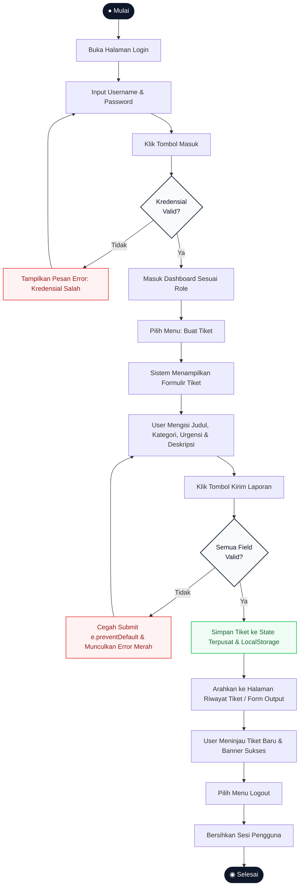

# DOKUMEN PROPOSAL & PEMODELAN SISTEM
**Mata Kuliah**: Web & Mobile Application Development (Week 7 Midterm)  
**Kelompok**: 12  
**Anggota Tim**:
1. Johannes Christian Tahun (No. 25)
2. Aldrich Taqi Marvel (No. 5)
3. Darren Christian Rapang (No. 11)
4. Ivan Pratama (No. 21)

---

## 1. Project Description, Actors & Permission Matrix (Kriteria A1)

### A. Topik & Judul Proyek
**QuickDesk** — Web-Based Internal IT Helpdesk & Support Ticketing Portal.

### B. Problem Statement (Rumusan Masalah)
Di lingkungan perkantoran maupun kampus, pelaporan kendala teknis (seperti komputer lab rusak, proyektor mati, Wi-Fi terputus, atau software bermasalah) sering kali disampaikan secara tidak terstruktur melalui pesan WhatsApp/lisan. Hal ini menyebabkan:
1. Banyak kendala teknis tidak terdokumentasi dengan baik dan lambat ditangani karena tidak ada pencatatan terpusat.
2. Pengguna (karyawan/mahasiswa) tidak dapat memantau status pengerjaan tiket kendala mereka secara transparan.
3. Tim IT Support kesulitan memprioritaskan perbaikan dan melacak beban tiket harian.

### C. Project Goal (Tujuan Proyek)
Membangun aplikasi web Single Page Application (SPA) berbasis React yang menyediakan sistem pelaporan kendala IT terpusat. Sistem ini memungkinkan pengguna membuat laporan kendala terstruktur secara mandiri, serta memudahkan tim IT Support untuk memantau, memvalidasi, dan memperbarui status penanganan secara transparan, terstruktur, dan efisien.

### D. Aktor Sistem & Tujuan (Actors & Goals)
Sistem memiliki **2 Aktor** dengan tujuan berbeda:
1. **Aktor 1: `Employee` / `User` (Pelapor Kendala)**
   * **Goal**: Melaporkan masalah teknis IT secara cepat dengan detail yang jelas, memantau riwayat tiket keluhan miliknya, dan memastikan masalahnya mendapatkan tindak lanjut dari teknisi IT.
2. **Aktor 2: `IT Admin` / `Technician` (Pengelola Layanan IT)**
   * **Goal**: Memantau metrik seluruh tiket yang masuk secara terpusat, memfilter keluhan berdasarkan kategori atau urgensi, serta memperbarui status penanganan tiket dari *Open* menjadi *In Progress* atau *Resolved*.

### E. Permission Matrix (Matriks Hak Akses Halaman & Fitur)
Berikut adalah matriks izin yang memetakan akses antar peran terhadap menu dan fitur aplikasi:

| Halaman / Fitur | Tamu (Belum Login) | Role: `Employee / User` | Role: `IT Admin` |
| :--- | :---: | :---: | :---: |
| **Login Page** | ✅ Akses Penuh | ❌ Diarahkan ke Dashboard | ❌ Diarahkan ke Dashboard |
| **Dashboard** | ❌ Terproteksi (Redirect) | ✅ Melihat ringkasan tiket miliknya | ✅ Melihat seluruh metrik sistem & daftar tiket global |
| **Create Ticket (Form)** | ❌ Terproteksi (Redirect) | ✅ Mengisi & submit keluhan baru | ❌ Disembunyikan dari menu |
| **Ticket History / Output**| ❌ Terproteksi (Redirect) | ✅ Melihat tiket yang baru di-submit | ✅ Melihat tabel riwayat seluruh tiket |
| **Update Ticket Status** | ❌ Terproteksi | ❌ Tidak punya izin | ✅ Dapat mengubah status (*In Progress/Resolved*) |
| **Logout** | ❌ Tidak ada | ✅ Keluar sesi | ✅ Keluar sesi |

---

## 2. Use Case Diagram & Written Use Case (Kriteria A2)

### A. Use Case Diagram
*(Lampirkan gambar: `01_use_case_diagram.png`)*

Diagram mencakup batasan sistem (*System Boundary*), 2 Aktor, dan 6 Use Case berbasis tugas pekerjaan (bukan nama halaman):
- **UC-01**: Melakukan Autentikasi (Login)
- **UC-02**: Memantau Metrik & Status Tiket
- **UC-03**: Mengajukan Tiket Keluhan Baru (*Form Utama*)
- **UC-04**: Meninjau Rincian Tiket Keluhan
- **UC-05**: Memperbarui Status Penanganan Tiket
- **UC-06**: Mengakhiri Sesi (Logout)

### B. Dokumen Use Case Tertulis Form (UC-03: Mengajukan Tiket Keluhan Baru)
* **Use Case ID**: UC-03
* **Use Case Name**: Mengajukan Tiket Keluhan Baru (*Submit IT Support Ticket*)
* **Primary Actor**: `Employee / User`
* **Pre-condition**: User telah berhasil login dengan role `user` dan berada pada halaman formulir pengajuan tiket (`/create-ticket`).
* **Post-condition**: Tiket keluhan baru berhasil divalidasi, disimpan ke dalam state aplikasi, dan ditampilkan pada daftar riwayat tiket pengguna.
* **Main Success Scenario (Basic Flow)**:
  1. User memilih menu "Buat Tiket Baru" dari navigasi utama.
  2. Sistem menampilkan formulir pengajuan kendala yang berisi field: Judul Masalah, Kategori Masalah, Prioritas Urgensi, dan Rincian Deskripsi.
  3. User memasukkan judul kendala teknis (minimal 5 karakter).
  4. User memilih kategori kendala dari dropdown (misal: *Hardware*, *Software*, atau *Network*).
  5. User memilih tingkat urgensi kendala (misal: *Low*, *Medium*, atau *High*).
  6. User mengetikkan deskripsi lengkap kendala pada textarea deskripsi.
  7. User menekan tombol "Kirim Laporan".
  8. Sistem memvalidasi seluruh input data formulir (semua field wajib terisi dan memenuhi batas minimal panjang karakter).
  9. Sistem membuat entri tiket baru dengan ID unik, timestamp saat ini, dan status default *"Open"*.
  10. Sistem menyimpan tiket ke dalam state terpusat dan mengarahkan user ke halaman Riwayat Tiket / Form Output dengan pesan sukses.
* **Alternative Flows (Percabangan Kegagalan Validasi)**:
  * **3a / 4a / 5a / 6a: Field Kosong atau Tidak Memenuhi Syarat saat Submit**
    1. User mengosongkan salah satu field wajib atau memasukkan judul kurang dari 5 karakter, lalu menekan tombol "Kirim Laporan".
    2. Sistem mencegah proses submit (`e.preventDefault()`).
    3. Sistem menampilkan pesan error berwarna merah di bawah masing-masing field yang bermasalah (misal: *"Judul wajib diisi minimal 5 karakter"*, *"Silakan pilih kategori kendala"*, *"Deskripsi masalah tidak boleh kosong"*).
    4. Fokus input diarahkan ke field pertama yang mengalami error.
    5. User memperbaiki isian data yang salah.
    6. Alur kembali ke langkah 7 pada Basic Flow.

---

## 3. Activity Diagram (Kriteria A3)
*(Lampirkan berkas gambar visual: `assets_proposal/02_activity_diagram.png`)*

### A. Kode Sumber Mermaid UML (Diagram-as-Code)

### B. Narasi Alur Aktivitas Sistem
Diagram alur aktivitas sistem dirancang lengkap menggunakan notasi formal (Start, Decision, Action, End) dengan alur:
1. Mulai ➔ User memasukkan kredensial login.
2. **Decision (Kredensial Valid?)**:
   - Jika **Tidak**: Sistem menampilkan alert error merah *"Kredensial tidak valid"*, lalu kembali ke form input login.
   - Jika **Ya**: Sistem menyimpan sesi role dan menampilkan Dashboard.
3. User memilih menu "Buat Tiket Baru".
4. Sistem me-render formulir pengajuan tiket.
5. User mengisi field dan menekan tombol "Kirim Laporan".
6. **Decision (Validasi Lolos?)**:
   - Jika **Tidak**: `e.preventDefault()` aktif, muncul pesan error merah di bawah field yang salah, alur kembali ke pengisian form.
   - Jika **Ya**: Sistem menyimpan tiket ke state induk dengan status default *"Open"*.
7. Sistem mengarahkan user ke halaman Form Output / Riwayat Tiket.
8. User meninjau tiket yang baru saja dibuat beserta banner sukses.
9. User menekan tombol "Logout" ➔ Sesi dibersihkan ➔ Selesai.

---

## 4. UI Design / Wireframe (Kriteria A4)

Desain antarmuka dirancang dengan mematuhi **4 Prinsip Desain UI**:
1. **Visual Hierarchy**: Elemen penting (judul halaman, tombol submit utama, status badge) memiliki bobot visual dan kontras yang lebih tegas.
2. **Spacing**: Konsistensi margin dan padding (grid 8px) antar elemen formulir dan kartu ringkasan.
3. **Consistency**: Pola navbar, warna tombol (*primary blue*, *danger red*), dan gaya font seragam di seluruh halaman.
4. **Contrast**: Teks gelap di atas latar belakang terang dengan rasio kontras tinggi, serta status badge berwarna kontras (*Open = Amber*, *Resolved = Green*, *High Urgency = Red*).

### Lampiran Wireframe:
1. **Wireframe Login**: *(Lampirkan `03_wireframe_login.png`)*
2. **Wireframe Dashboard**: *(Lampirkan `04_wireframe_dashboard.png`)*
3. **Wireframe Form Input**: *(Lampirkan `05_wireframe_form.png`)*
4. **Wireframe Form Output**: *(Lampirkan `06_wireframe_output.png`)*
