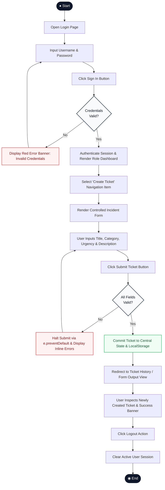

# SYSTEM PROPOSAL & ARCHITECTURAL MODELING DOCUMENT
**Course**: Web & Mobile Application Development (Week 7 Midterm Project)  
**Academic Year**: 2026  
**Group**: 12  
**Team Members**:
1. **Johannes Christian Tahun** (No. 25)
2. **Aldrich Taqi Marvel** (No. 5)
3. **Darren Christian Rapang** (No. 11)
4. **Ivan Pratama** (No. 21)

---

## 1. Project Description, Actors & Permission Matrix (Criterion A1)

### A. Topic & Project Title
**QuickDesk** — Web-Based Internal IT Helpdesk & Support Ticketing Portal.

### B. Problem Statement
In enterprise and academic campus environments, technical incident reporting (such as workstation malfunctions, network disconnections, or software licensing issues) is frequently communicated through informal channels like instant messaging (WhatsApp/Telegram) or verbal complaints. This practice causes critical operational bottlenecks:
1. **Unrecorded Incidents**: Numerous technical issues are misplaced or delayed in resolution due to the absence of a centralized logging registry.
2. **Zero Transparency**: End-users (employees/students) lack real-time visibility into the diagnostic progress or resolution status of their reported problems.
3. **Inefficient Triage**: IT Support personnel struggle to prioritize urgent issues, assign technician bandwidth, and monitor daily operational workload.

### C. Project Goal
To develop a responsive Single Page Application (SPA) built on React that establishes a centralized, structured IT incident reporting and tracking portal. The system enables users to independently submit technical issues through a controlled form, while empowering IT administrators to monitor, triage, and update ticket statuses in a transparent, structured, and efficient workflow.

### D. System Actors & Goals
The system defines **two distinct user personas (actors)** with specific operational goals:
1. **Actor 1: `Employee / User` (Incident Reporter)**
   * **Goal**: Quickly submit structured technical reports with clear contextual details, track personal ticket history in real time, and ensure reported issues receive prompt IT attention.
2. **Actor 2: `IT Admin / Technician` (IT Service Administrator)**
   * **Goal**: Centrally monitor global system ticket metrics, filter reported issues by category or urgency level, and manage the incident lifecycle by transitioning ticket statuses from `OPEN` to `IN_PROGRESS` or `RESOLVED`.

### E. Permission Matrix (Role-Based Access Control)
The following matrix defines route and feature authorization across all application views:

| Page / Feature | Unauthenticated Guest | Role: `Employee / User` | Role: `IT Admin / Technician` |
| :--- | :---: | :---: | :---: |
| **Login Page** | Full Access | Redirected to Dashboard | Redirected to Dashboard |
| **Operational Dashboard** | Protected (Redirect to Login) | Views personal ticket metrics & history | Views global campus metrics & all active tickets |
| **Create Ticket (Form)** | Protected (Redirect to Login) | Full Access (Create & Submit) | Restricted (Hidden from navigation menu) |
| **Ticket History / Output** | Protected (Redirect to Login) | Views personal tickets & recent submission | Views comprehensive organizational ticket registry |
| **Update Ticket Status** | Protected | Unauthorized (Read-only) | Full Access (Can transition status to `IN_PROGRESS` / `RESOLVED`) |
| **Logout** | Not Applicable | Terminates session | Terminates session |

---

## 2. Use Case Diagram & Written Use Case Specification (Criterion A2)

### A. Use Case Diagram
*(Refer to visual asset: `assets_proposal/01_use_case_diagram.png`)*

The diagram specifies the system boundary (*QuickDesk System*), 2 primary actors, and 6 task-based use cases:
* **UC-01**: User Authentication (Login)
* **UC-02**: Monitor Operational Metrics & Ticket Feeds
* **UC-03**: Submit New IT Incident Ticket (*Primary Form Use Case*)
* **UC-04**: Review Ticket History & Detailed Records
* **UC-05**: Update Incident Resolution Status
* **UC-06**: Terminate User Session (Logout)

### B. Formal Written Use Case Specification (UC-03: Submit New Support Ticket)
* **Use Case ID**: UC-03
* **Use Case Name**: Submit New Support Ticket
* **Primary Actor**: `Employee / User`
* **Pre-condition**: The user has successfully logged in with the `user` role and is currently viewing the ticket creation view (`/create-ticket`).
* **Post-condition**: The technical incident is validated, committed to the centralized application state (`TicketContext`) and browser storage, and immediately rendered at the top of the user's ticket history.

#### Main Success Scenario (Basic Flow):
1. The user navigates to the "Buat Tiket" (Create Ticket) route from the primary navigation bar.
2. The system renders the incident submission form containing: Problem Title, Category, Urgency Priority, and Detailed Description.
3. The user enters a descriptive title for the incident (minimum 5 characters).
4. The user selects a technical category from the dropdown menu (*Hardware*, *Software*, *Network*, or *Access & Account*).
5. The user selects an urgency priority level (*LOW*, *MEDIUM*, or *HIGH*).
6. The user inputs a comprehensive technical description including the physical location and hardware identifiers.
7. The user clicks the "Kirim Laporan Tiket" (Submit Ticket) button.
8. The system intercepts the native form submission (`e.preventDefault()`) and executes validation on all input fields.
9. Upon passing validation, the system constructs a new ticket object with a unique sequential identifier (`TCK-XXX`), current timestamp, and default status `OPEN`.
10. The system commits the new ticket to the central state store, persists it to `localStorage`, and redirects the user to the Ticket History view (`/my-tickets`) accompanied by a success banner.

#### Alternative Flows (Validation Error Handling):
* **3a / 4a / 5a / 6a: Incomplete or Invalid Input on Submission**
  1. The user leaves a mandatory field blank or provides a title shorter than 5 characters, then triggers form submission.
  2. The system catches the invalid state and halts the submission pipeline.
  3. The system applies error styling and renders red inline alert banners directly beneath each faulty input field (e.g., *"Judul kendala wajib diisi minimal 5 karakter"*, *"Silakan tentukan kategori kendala"*).
  4. The input focus is automatically shifted to the first invalid field.
  5. The user corrects the invalid inputs.
  6. The workflow resumes at step 7 of the Basic Flow.

---

## 3. Activity Diagram (Criterion A3)
*(Refer to visual asset: `assets_proposal/02_activity_diagram.png`)*

### A. Mermaid UML Source Code (Diagram-as-Code)

### B. Procedural Execution Narrative
The operational activity workflow strictly implements standard UML activity notation (Initial Node, Action States, Decision Diamonds, and Final State):
1. **Start** ➔ The user visits the application portal and inputs authentication credentials.
2. **Decision (Credentials Valid?)**:
   * If **Invalid**: The system displays a red warning banner (*"Kredensial tidak valid"*), looping back to input fields.
   * If **Valid**: The system establishes the session role and transitions to the Dashboard.
3. The user selects the "Buat Tiket" menu.
4. The system mounts and renders the controlled form view.
5. The user populates all incident fields and clicks "Kirim Laporan".
6. **Decision (Validation Passed?)**:
   * If **Invalid**: Submission is halted via `e.preventDefault()`, inline field errors are shown, and the user returns to editing.
   * If **Valid**: The system instantiates the new ticket record with status `OPEN` and commits it to the central state store.
7. The user is redirected to the Form Output / Ticket History view.
8. The newly submitted ticket is highlighted at the top of the feed alongside a confirmation banner.
9. The user clicks "Logout" ➔ Session context is purged ➔ **End**.

---

## 4. UI Design & Wireframes (Criterion A4)

The user interface follows four fundamental **Human-Grade Software Engineering & UI Design Principles**:
1. **Visual Hierarchy**: Crucial elements (view titles, primary action buttons, status pills) possess distinct typographic contrast and bold font weights (`font-weight: 700`), establishing an intuitive visual path.
2. **Spacing & Proximity**: All form inputs, stat cards, and table cells adhere to an 8px grid system with consistent margins and padding, ensuring high data density without clutter.
3. **Consistency**: Global header navigation, monochromatic Lucide SVG icons, border styles (`border: 1px solid #e2e8f0`), and standardized badge colors are applied uniformly across all 4 views.
4. **Contrast & Accessibility**: Text elements meet WCAG AA contrast standards (dark slate `#0f172a` against white `#ffffff` and subtle `#f8fafc` backgrounds). Color is never used as the sole indicator of state (each badge combines distinct text labels, border lines, and background tinting).

### Wireframe Assets:
1. **Wireframe 1: Authentication View (`03_wireframe_login.png`)**  
   Centrally aligned authentication card, brand logo with official `Server` SVG icon, input fields with leading `User` and `Lock` vector icons, error notification banner, and clean demo credential documentation.
2. **Wireframe 2: Operational Dashboard (`04_wireframe_dashboard.png`)**  
   Role-differentiated dashboard featuring 4 quantitative stat metric cards with Lucide vector icons, multi-column search and filter toolbar, and a high-density operational data table with inline status transition controls.
3. **Wireframe 3: Ticket Creation Form (`05_wireframe_form.png`)**  
   Controlled form view featuring semantic breadcrumbs, required field indicators, a two-column responsive category/urgency grid, and primary submit and reset actions.
4. **Wireframe 4: Form Output / Ticket History (`06_wireframe_output.png`)**  
   Confirmation view featuring an enterprise green success notification banner, active filter tabs, and structured ticket cards highlighting newly created records with blue accent borders and `BARU DITAMBAHKAN` status tags.
